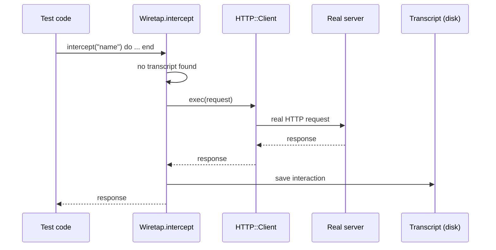
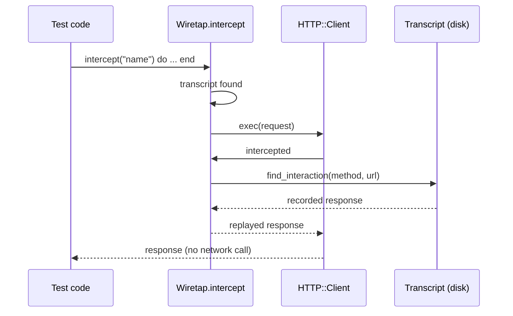

# Wiretap.cr

A Crystal shard for testing by intercepting and replaying http requests with streaming support.

## AI Use

See [DISCLOSURE](DISCLOSURE.md) for how I used AI for this project.

## Installation

1. Add the dependency to your `shard.yml`:

   ```yaml
   development_dependencies:
      termify:
        github: nogginly/wiretap.cr
   ```

2. Run `shards install`

## Usage

### How Wiretap works

Wiretap sits between your test code and `HTTP::Client`. On the first run it lets requests through to the real server and saves each request/response pair to a **transcript** — a JSON file on disk. On subsequent runs it intercepts matching requests and replays the saved response without touching the network.

**First run — record**



**Subsequent runs — replay**



Transcripts are stored as human-readable JSON under `spec/transcripts/` and should be committed to version control. Once recorded, your tests run offline, deterministically, and fast.

---

### Configuration

Place this in `spec/spec_helper.cr`:

```crystal
require "wiretap"

Wiretap.configure do |c|
  c.transcript_dir = "spec/transcripts"  # default
  c.record_mode    = :once               # default
  c.filter_headers << "X-Custom-Key"     # add to the default list
end
```

`filter_headers` — header names whose values are replaced with `[FILTERED]`
before saving. `Authorization` and `X-Api-Key` are filtered by default.

---

### Record modes

|Mode     |Behaviour                                                      |
|---------|---------------------------------------------------------------|
|`:once`  |Record if no transcript exists; strict replay if one does.     |
|`:always`|Always re-record, discarding any existing transcript.          |
|`:none`  |Strict replay only. Raise on any request not in the transcript.|

The default is `:once`. Override per block when needed:

```crystal
Wiretap.intercept("my_test", mode: :none) do
  # ...
end
```

---

### Basic usage

#### GET request

```crystal
it "returns the model list" do
  Wiretap.intercept("list_models") do
    response = HTTP::Client.get(
      "https://api.example.com/v1/models",
      HTTP::Headers{"Authorization" => "Bearer #{ENV["API_KEY"]}"}
    )
    response.status.code.should eq(200)
  end
end
```

The first time this runs, the real request is made and saved to
`spec/transcripts/list_models.json`. Every run after replays it.

#### POST with JSON body

```crystal
it "returns a chat completion" do
  Wiretap.intercept("chat_completion") do
    response = HTTP::Client.post(
      "https://api.example.com/v1/chat/completions",
      headers: HTTP::Headers{
        "Authorization" => "Bearer #{ENV["API_KEY"]}",
        "Content-Type"  => "application/json",
      },
      body: {
        model:    "my-model",
        messages: [{ role: "user", content: "Hello" }],
      }.to_json
    )
    result = JSON.parse(response.body)
    result["choices"][0]["message"]["content"].as_s.should_not be_empty
  end
end
```

#### Testing error responses

```crystal
it "raises on a 429 rate limit response" do
  Wiretap.intercept("rate_limit_error") do
    response = HTTP::Client.post("https://api.example.com/v1/chat/completions", ...)
    response.status.code.should eq(429)
  end
end
```

Record this once against a real rate-limited request, or create the
transcript by hand — any valid JSON file in `spec/transcripts/` works.

---

### Using with Spectator

Wiretap has no dependency on any test framework. The `intercept` block works
identically inside Spectator examples:

```crystal
describe MyLLMClient do
  it "parses the completion response" do
    Wiretap.intercept("completion") do
      client = MyLLMClient.new
      result = client.complete("Say hello")
      result.should eq("Hello!")
    end
  end
end
```

For suite-wide setup with Spectator, use its `before_suite` hook:

```crystal
Spectator.before_suite do
  Wiretap.configure do |c|
    c.record_mode = :none  # no live calls in CI
  end
end
```

---

### Transcript files

A transcript is a plain JSON file you can read, edit, and commit:

```json
{
  "name": "chat_completion",
  "recorded_with": "wiretap/0.1.0",
  "interactions": [
    {
      "request": {
        "method": "POST",
        "url": "https://api.example.com/v1/chat/completions",
        "headers": {
          "Authorization": "[FILTERED]",
          "Content-Type": "application/json"
        },
        "body": "{\"model\":\"my-model\",\"messages\":[{\"role\":\"user\",\"content\":\"Hello\"}]}"
      },
      "response": {
        "status": 200,
        "headers": {
          "Content-Type": "application/json"
        },
        "body": "{\"choices\":[{\"message\":{\"role\":\"assistant\",\"content\":\"Hello!\"}}]}"
      },
      "recorded_at": "2025-05-10T12:00:00Z"
    }
  ]
}
```

To update a transcript, delete the file and run the test once with network
access, or set `mode: :always` for that block temporarily.

---

### Recommended CI setup

In CI you want strict replay — no live calls, no network dependency:

```crystal
# spec/spec_helper.cr
Wiretap.configure do |c|
  c.record_mode = ENV["CI"]? ? :none : :once
end
```

This uses `:once` locally (recording new transcripts as you write tests)
and `:none` in CI (failing loudly if a transcript is missing, which means
a test was added without a recorded transcript).

## Development

See [DEVELOPMENT](./DEVELOPMENT.md)

## Contributions, by invitation!

*With apologies*, at this time contributions are *by invitation only* and limited to people I know and see often.

These are early days for _Wiretap_ and I am busy with family and work.

At this time I want to work on this at a manageable pace.
